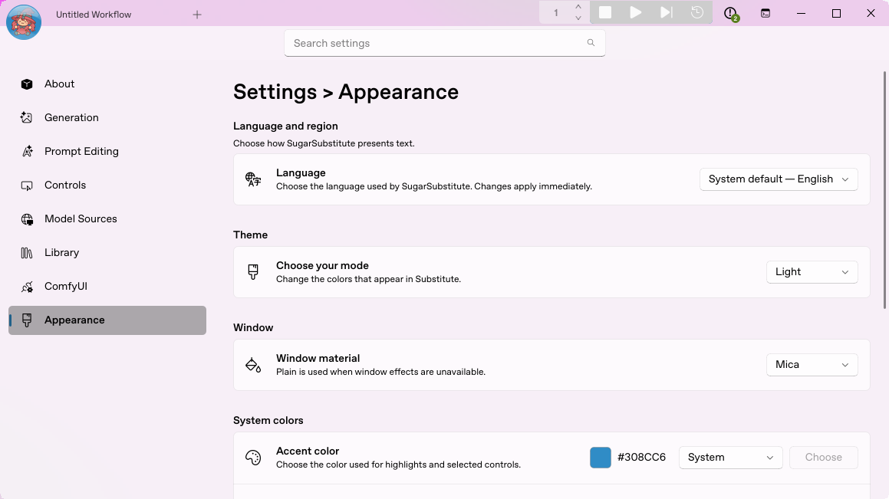
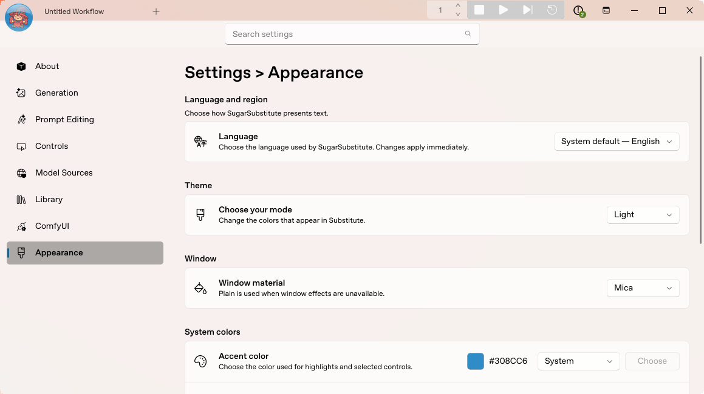
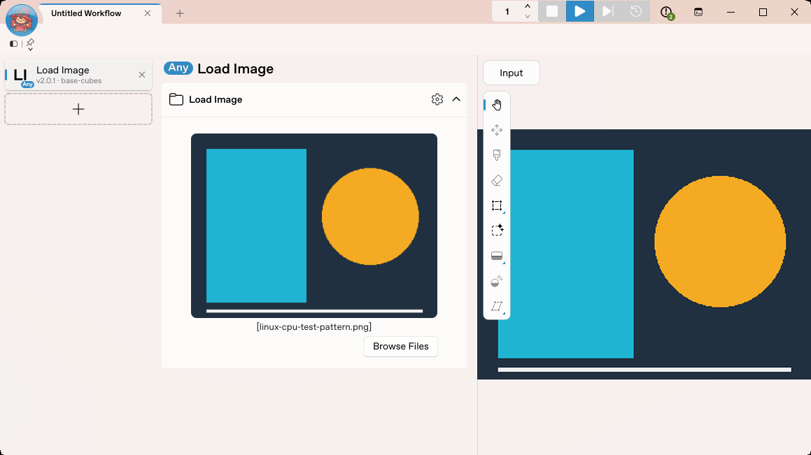

# Linux automatic CuteMica discovery

Verified on the real Linux X11 desktop on 2026-10-01. These are captures of the actual Substitute window using the installed CuteMica fork. The wallpaper override was unset throughout this run.

- [Substitute source](https://github.com/Daisy-Bluemel/SugarSubstitute/commit/e32af787324a9b6d6f3a9ad1acc0b4cc45341646)
- [CuteMica provider source](https://github.com/Daisy-Bluemel/CuteMica/commit/831ec759d867ddd566bf2ec44154d4577ea8b8ee)
- [Measured state](verification.json)

## Actual wallpaper changes

The desktop advertises XFCE, but its wallpaper is owned by Orbit. CuteMica now identifies that active owner and reads its current image through the supported appearance interface. Substitute's wallpaper source provider reports `orbit`, material reports `cutemica`, and readiness remains true.

The actual desktop wallpaper was changed orange → violet → orange. In the same running app, material generations advanced 1 → 2 → 3. Both images below use the same window geometry and Light/Mica preferences. The recorded background pixel at (500,550) changed from RGB (247,239,247) on violet to (247,240,238) on orange.

### Violet wallpaper

### Orange wallpaper

## Held drag and workflow

A native held drag recorded 200 timed samples across six positions, 15 Move events and 16 Paint events. All samples used Orbit discovery, had no wallpaper override, and retained ready material at generation 3 with one cached texture identity. Seven samples occurred while the window was temporarily inactive during the drag. Intermediate positions were painted before release.

The saved CPU Load Image workflow completed again. Its 320×240 output was pixel-identical to the generated test fixture, and the queue returned to idle.

## Clean restart

The temporary passive observer only recorded state, events and this application's pixels; it did not force painting or substitute a renderer. It was removed before the final checks and the following cold restart. The normal application restored its saved workflow and automatic Mica from clean source.

## Verification and limits

- CuteMica: 151 tests passed; 15 native/opt-in tests and four platform collections skipped. Full strict typing, formatting/lint, launch smoke and both 600-frame cached-motion benchmarks passed
- Substitute pin: 57 focused tests passed after rebasing and removing the observer; strict typing for the changed Python files and full lint/format, architecture and test-governance checks passed
- The downloaded provider archive matched all 173 files in its published Git tree; a wheel built from the exact hash-locked URL contains the provider modules unchanged. Both installed frontend and development environments passed the strict source-identity check
- Exact pixel/crop registration against Orbit's compositor remains unverified. No full-desktop capture was used for this proof
- Native Windows/macOS and other desktop sessions were not qualified by this run. GNOME/Plasma path and GNOME/MATE disabled-image fixes have deterministic provider regressions; color-only mode remains unsupported. XFCE workspace/monitor matching still needs a separate qualification pass
- Full Substitute aggregate gates and frozen application packaging remain part of the continuing Linux validation. This is a verified development checkpoint, not a release qualification. CuteMica's upstream license metadata remains absent
