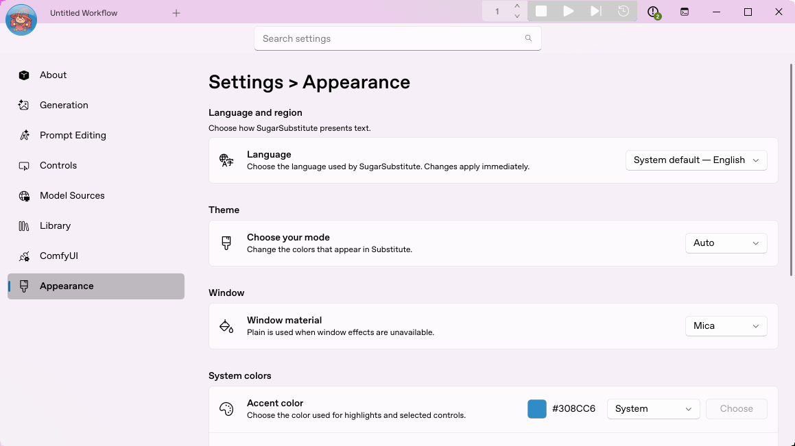
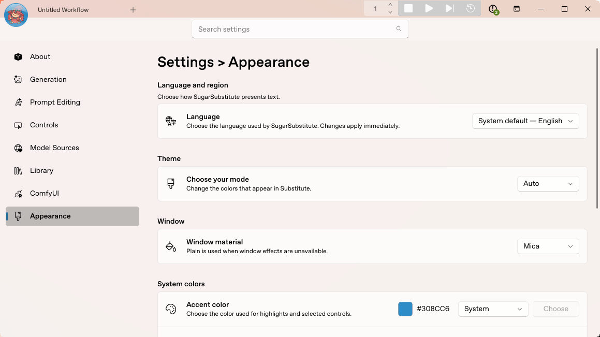
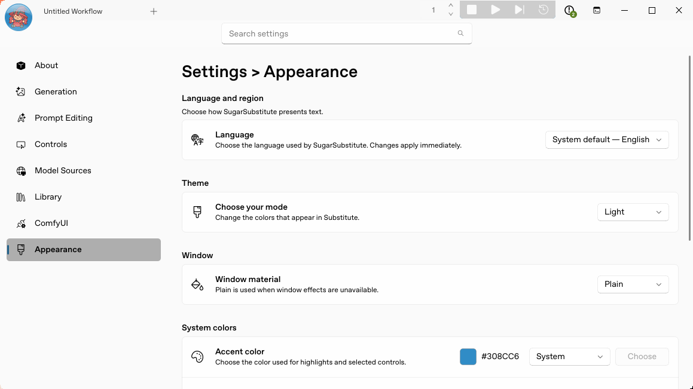
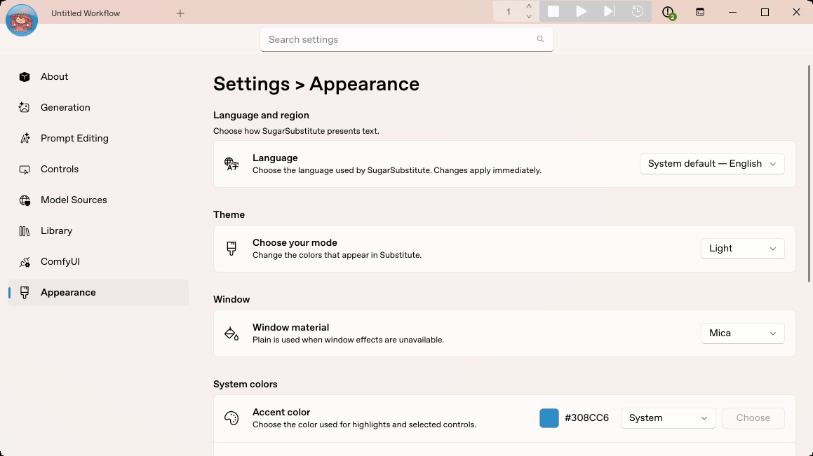
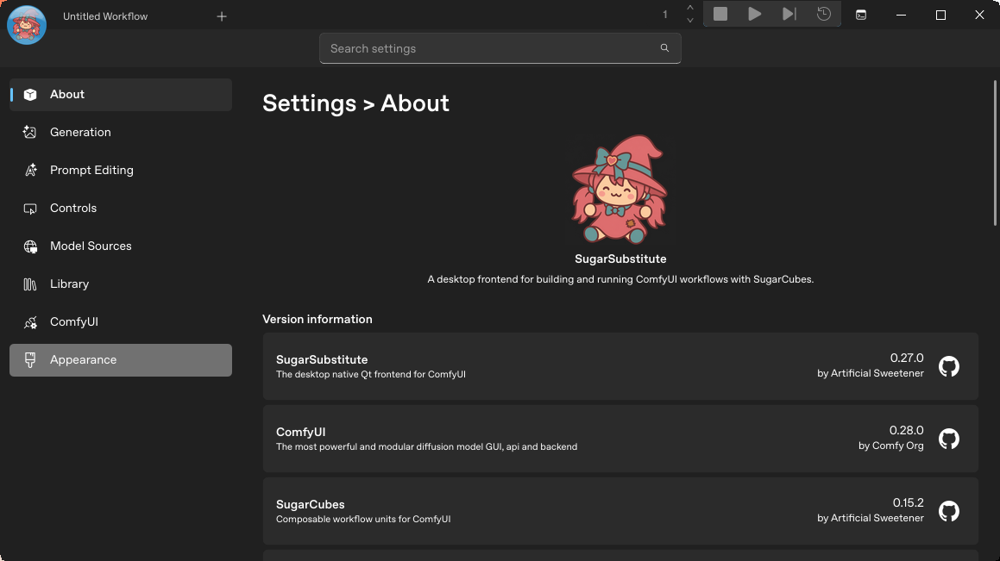
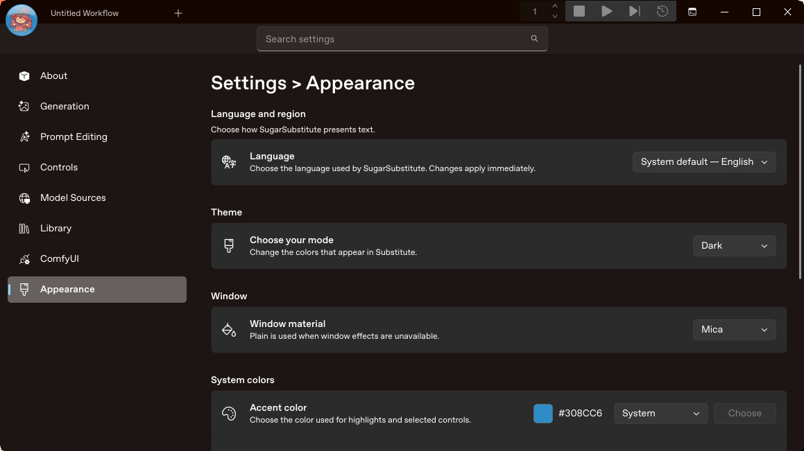
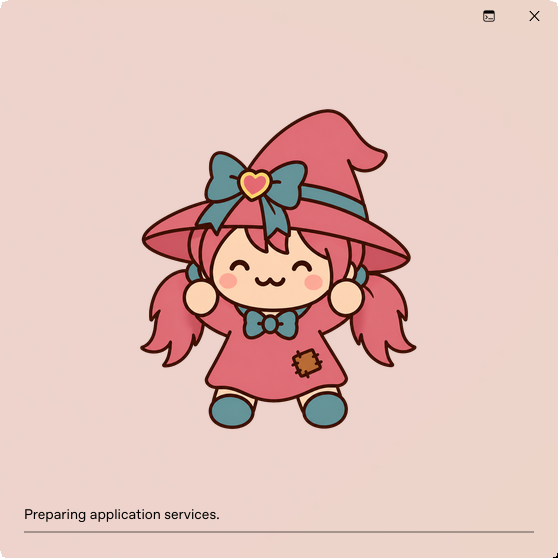
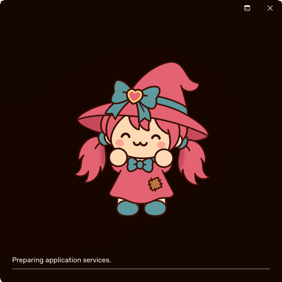
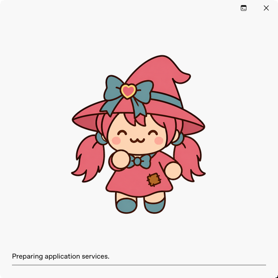

# Linux CuteMica runtime evidence

These screenshots show the real SugarSubstitute desktop application running through `main.py` on Linux/X11 with Qt 6.11.2. They are native window captures, not mockups or widget-rendering tests. The source checkpoint is [94ccf72968112cf01cf9aa337716a4b222dffe54](https://github.com/Daisy-Bluemel/SugarSubstitute/commit/94ccf72968112cf01cf9aa337716a4b222dffe54).

## Wallpaper response

The same running window changed from violet to warm orange after the actual desktop wallpaper and the explicit wallpaper source were changed to the same new image bytes. The material generation increased from 1 to 2 and its texture identity changed. Window position and theme stayed fixed.

| Violet wallpaper | Orange wallpaper |
| --- | --- |
|  |  |

This custom Orbit desktop identifies itself as XFCE, but its default wallpaper metadata is unavailable to CuteMica. That default path was tested and correctly fell back to Plain. Successful material captures here use `SUGARSUBSTITUTE_MICA_WALLPAPER` pointing to an image with bytes identical to the wallpaper applied to the desktop. This proves the renderer and live file watching; it does not establish automatic wallpaper discovery on this desktop.

## Plain and Mica settings

The Linux menu exposes Plain and Mica. Both choices survived GUI restarts and full process restarts. The final screenshot below was taken after removing all temporary diagnostic hooks and launching normal `main.py` again.

| Plain, light | Mica, light, final clean source |
| --- | --- |
|  |  |

| Plain, dark (About page) | Mica, dark (Appearance page) |
| --- | --- |
|  |  |

## Movement and recovery

A held native window-manager drag generated 29 Qt Move events and 31 Paint events. Twelve positions were captured, including nine while Qt reported the window inactive. Every one of the 200 timed observations stayed ready with provider `cutemica`; the texture generation stayed at 2 throughout the drag. The renderer reused its cached material and repainted during movement before release. See the event timestamps and changed positions in [verification.json](verification.json).

Fast moving-window screenshots showed compositor/capture offsets and occasional dock overlap, so those images are not presented as clean visual evidence. The measured events establish painting during the hold; they do not establish the latency of a remote desktop stream.

Temporarily making the explicit wallpaper file unavailable switched the actual window to Plain, with a missing-file diagnostic. Restoring the identical file recovered CuteMica without restarting. The failure warning was not repeated on every poll.

## Splash and corners

The real light splash has a black close glyph; the dark splash has a white close glyph. The early splash now reads the same saved explicit theme/material choices as the main window. Rounded masks were verified on restored splash/main windows; maximizing cleared the main mask and restoring reapplied it.

| Light Mica splash | Dark Mica splash | Light Plain splash |
| --- | --- | --- |
|  |  |  |

## Runtime and check status

The saved Load Image workflow ran after repeated appearance changes and produced a pixel-identical 320×240 image. Its queue returned to idle. Linux managed ComfyUI ran on CPU. GPU-only SeedVR2 startup failed on this computer, and the backend bundle still contains NVIDIA packages; those limits are separate from the working image workflow.

The renderer checkpoint passed 261 focused tests with one native Windows skip. The final startup correction passed 49 focused tests; an additional run after hook removal passed 39 tests. Targeted strict typing, full Ruff checks, formatting, architecture and test governance passed. Independent reviews identified and verified fixes for encoding corruption and installation-root normalization. Aggregate repository test/type suites and a package build were still pending when this evidence was recorded.

Windows keeps the existing native provider, but native Windows execution was not tested here. macOS rendering remains deferred. Early Auto/System appearance uses immediate Qt hints; parity with the main application's later native/portal provider is not claimed. CuteMica was pinned to upstream commit `5cbf43d201526e004f28f86785714c56f37067bc`; that upstream snapshot contains no license file, and no license was fabricated.

All selected images contain only the project UI and its generated test content. The temporary passive capture code is not included in this evidence branch or application source. Image hashes, capture times, native platform details and movement measurements are in [verification.json](verification.json).
